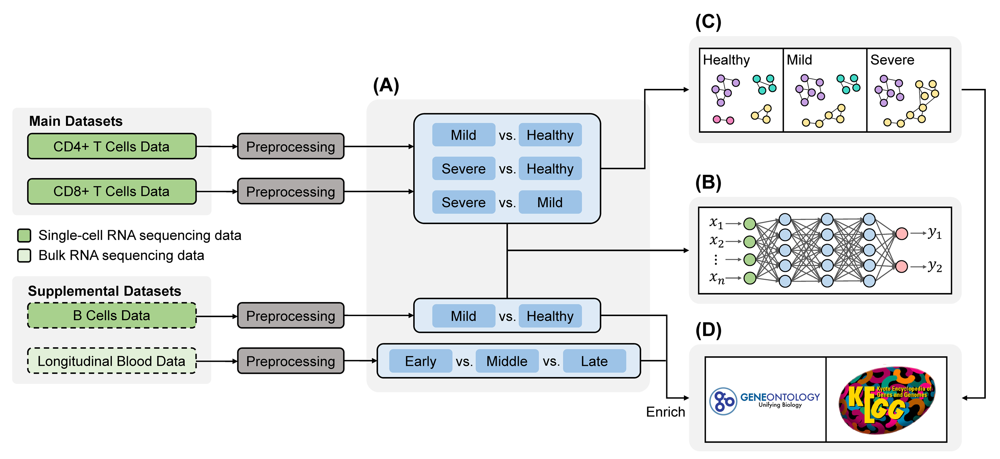

# UTRCOV2

This repo contains the code of CAMDA 2021 paper "Unraveling T cell responses for long term protection of SARS-CoV-2 infection".

## Table of Contents

- CD4+ T Cells & CD8+ T Cells
	- 01_Loading_and_Preprocessing
	- 02_Differential_Expression_Analysis
	- 03_Deep_Learning_on_DE_Genes
	- 04_Prepare_Submatrix_for_Network
	- 05_Develop_PIDC_Network (using Julia)
	- 06_Permutation_Test_between_Networks
	- 07_Network_Visualization
	- 08_Functional_Annotation
- B Cells
	- 01_Loading_and_Preprocessing
	- 02_Differential_Expression_Analysis
	- 03_Deep_Learning_on_DE_Genes
	- 04_Functional_Annotation
- Bulk Data